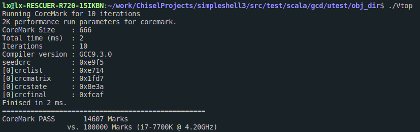
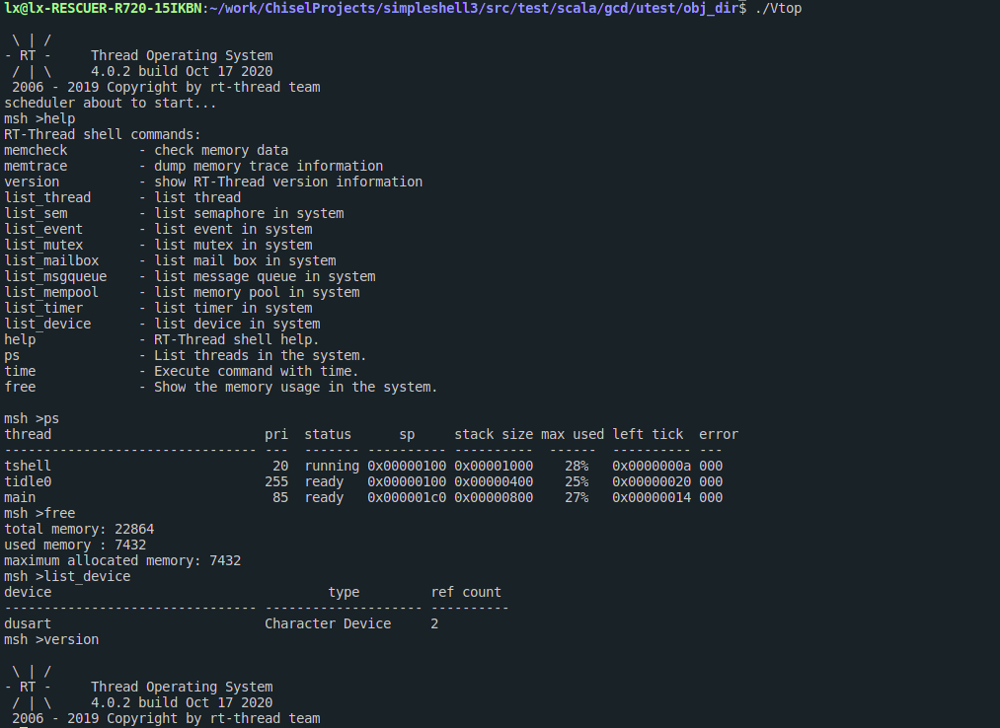

## 一生一芯项目

本仓库存放用于生成可以集成到soc的ysyx_lx的代码

### 目标

支持`RV64IMZicsr`指令集，实现M态，实现五级流水线，运行RT-Thread.:smile:

### 当前进度

+ 写完单周期的代码
+ 写完五级流水线代码
+ 完成csr模块
+ 利用`loadMemoryFromFile`和`verilator`和`nemu`对单周期代码涉及到的`RV64IMZicsr`指令集中的所有指令进行测试，测试通过
+ 基本完成对五级流水线的测试
+ 修改处理器核对外接口为标准的`AXI4`接口,通过了自己写的测试用例
+ 添加了时钟中断，没有测试
+ 完成一个简单的串口，访真时从C++ `vector`实现的`fifo`中读入，输出则直接输出到终端，写了一个`hello world`的测试用例，测试通过

### 问题列表

+ [x] 代码主要借鉴`sodor`，其代码的访存模块有bug，数据通路和控制通路一起连接到内存，导致有覆盖的问题，编译出来的`verilog`代码跟自己想法不一样
+ [x] 总线有点不太理解
+ [x] csr模块对时钟中断的支持不太理解，手册上提到用`mtime`和`mtimecmp`两个`memory-mapped register`，但是在寄存器编号上没有找到这两个寄存器，不是很清楚这两个寄存器的具体使用方式
+ [x] 编译出来的`jalr`指令的格式与手册上不符合
+ [x] 网上下载的测试代码总是有问题，要么死循环，要么编译出的指令是`RV64IMZicsr`以外的指令
+ [x] 核没有使用`cache`，直接用`AXI4`总线与`Ram`连接，流水线中的`IF`和`MEM`阶段如果同时需要访存，会发生结构冒险，现在用了一个`trick`来解决：一旦`MEM`阶段完成访存，但是`IF`阶段还没有完成访存，可以直接把`MEM`阶段提交，然后把`MEM`阶段设置为无效。可能会有点问题
+ [ ] 运行`MicroBench`的时候有浮点数异常，但是和`nemu`对比每一步的运行结果都是对的，注释了`seive`函数就都可以通过，不知道是不是这个函数有除0异常的情况

### 接下来的工作

- [x] 完善代码的csr模块
- [x] 编写单周期测试框架
- [x] 完成对单周期的测试
- [x] 同步将其修改为五级流水线
- [x] 测试五级流水线代码
- [x] 将测试框架重构以支持测试五级流水线
- [x] 目前的测试框架用到了一个`trick`来支持对`pc`跳转后的`nop`指令的跳过，后面需要再仔细改一下
- [x] 下载`riscv-toolchain`,做一个自动化的测试框架
- [x] 添加对于时钟中断的支持
- [ ] 深入读一下特权文档手册
- [x] 阅读`NutShell`的总线代码
- [x] 下载AM中的测试代码进行测试
- [x] 下载RT-Thread,编译测试
- [ ] 代码重构
- [ ] AM中的测试程序还有几个有问题，需要修改
- [ ] 时钟中断相关的代码可能还存在一些问题

### 成果

+ 成功运行`coremark`
  + 
+ 成功启动`RT-Thread`
  + 