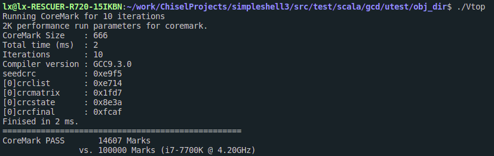
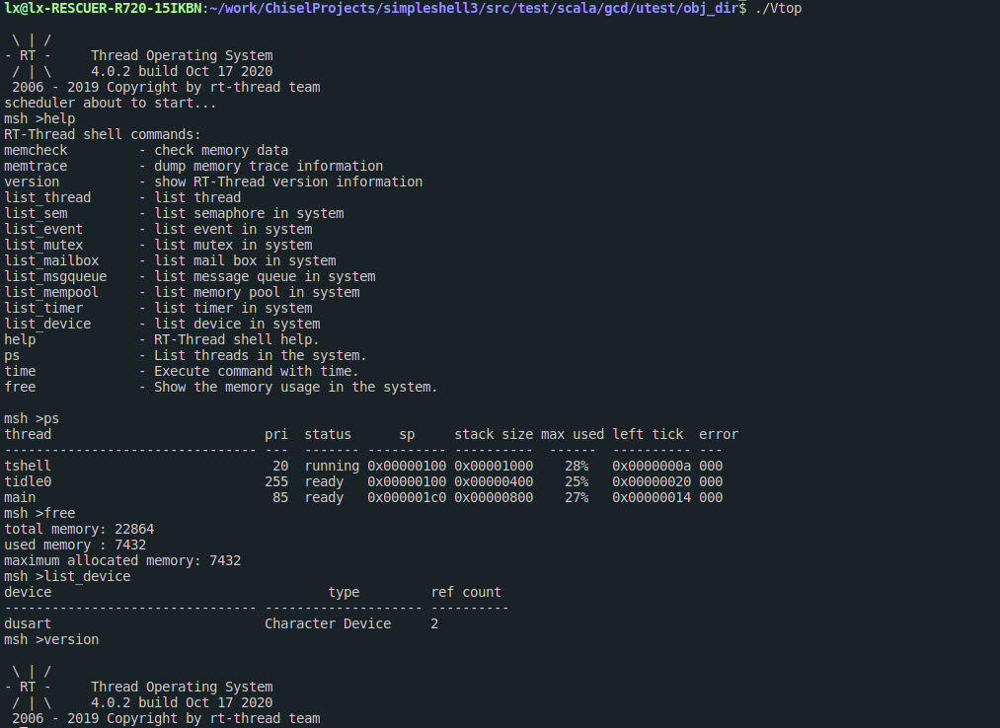
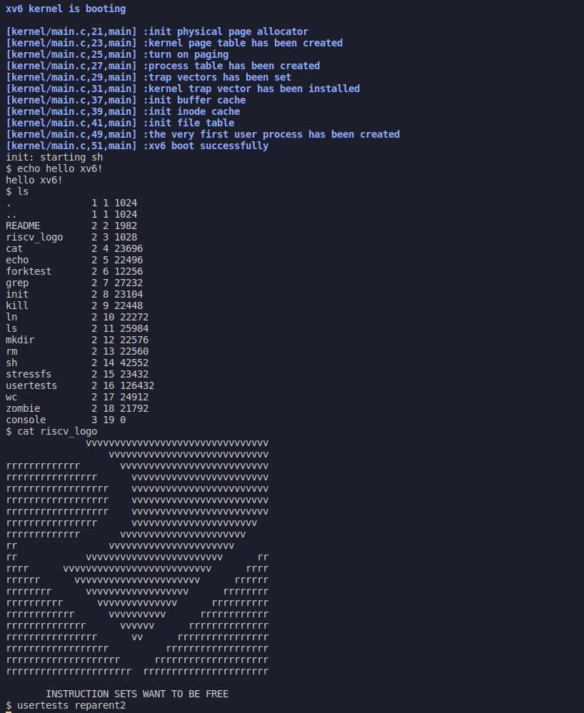
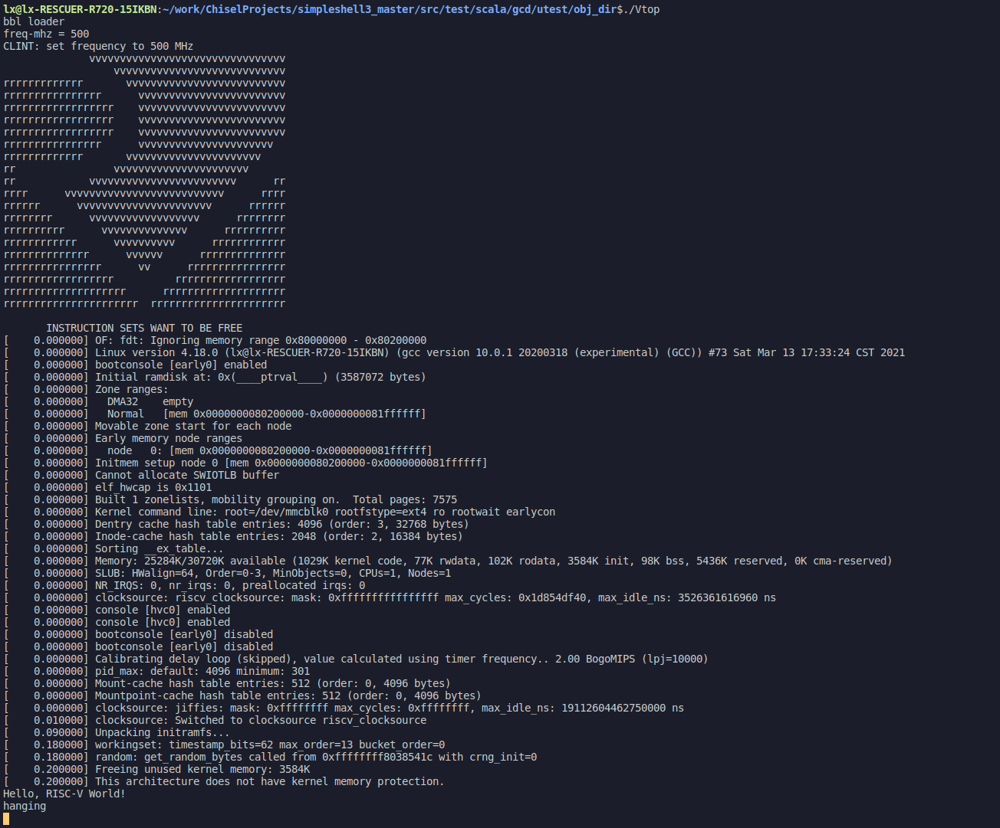

## 一生一芯项目

本仓库用于记录一生一芯项目的工作进度和代码

### 目标

支持`RV64IMZicsr`指令集，实现M态，实现五级流水线，运行RT-Thread.:smile:

### 下一阶段目标

支持`RV64IMAZicsr`指令集，实现M/S/U模式，实现TLB和Cache，运行XV6和Linux.:smile:

### 当前进度

+ 写完单周期的代码
+ 写完五级流水线代码
+ 完成csr模块
+ 利用`loadMemoryFromFile`和`verilator`和`nemu`对单周期代码涉及到的`RV64IMZicsr`指令集中的所有指令进行测试，测试通过
+ 基本完成对五级流水线的测试
+ 修改处理器核对外接口为标准的`AXI4`接口,通过了自己写的测试用例
+ 添加了时钟中断，没有测试
+ 完成一个简单的串口，访真时从C++ `vector`实现的`fifo`中读入，输出则直接输出到终端，写了一个`hello world`的测试用例，测试通过
+ 流片的版本不带`cache`，可以正确跑通`hello`测试用例
+ 目前正在`working`的版本有一个简单的直接映射`cache`，可以跑通`RTT`以及现有的所有测试用例
+ 大致实现了地址转换部分的代码，接入到流水线，在不打开`sapt`的`sv39`分页时，行为正常，但是还没测试开启分页时TLB和PTW的行为是否正常
+ 实现了完整的M/S/U特权模式，测试力度不大
+ 完成`sfence.vma`和写入`satp`时对TLB(iTLB，dTLB)的刷新，完成`fence.i`对Cache(iCache，dCache)的刷新，目前刷新的情况测试用例覆盖完整，行为正确
+ 完成A指令集的扩展，基本通过了测试，发现有设计不合理的地方，对处理器结构进行了修改，具体见`doc/xv6.md`
+ 成功启动xv6，运行了一个`echo`的用户程序，但是还存在一些问题
+ 成功启动xv6，运行了`ls,echo,mkdir,cd`等用户程序
+ 成功启动Linux，创建`init`进程，输出`hello riscv world!`
+ 流片已经冻结的版本在[here](https://github.com/happy-lx/ysyx_lx)

### 问题列表

+ [x] 代码主要借鉴`sodor`，其代码的访存模块有bug，数据通路和控制通路一起连接到内存，导致有覆盖的问题，编译出来的`verilog`代码跟自己想法不一样
+ [x] 总线有点不太理解
+ [x] csr模块对时钟中断的支持不太理解，手册上提到用`mtime`和`mtimecmp`两个`memory-mapped register`，但是在寄存器编号上没有找到这两个寄存器，不是很清楚这两个寄存器的具体使用方式
+ [x] 编译出来的`jalr`指令的格式与手册上不符合
+ [x] 网上下载的测试代码总是有问题，要么死循环，要么编译出的指令是`RV64IMZicsr`以外的指令
+ [x] 核没有使用`cache`，直接用`AXI4`总线与`Ram`连接，流水线中的`IF`和`MEM`阶段如果同时需要访存，会发生结构冒险，现在用了一个`trick`来解决：一旦`MEM`阶段完成访存，但是`IF`阶段还没有完成访存，可以直接把`MEM`阶段提交，然后把`MEM`阶段设置为无效。可能会有点问题
+ [x] 运行`MicroBench`的时候有浮点数异常，但是和`nemu`对比每一步的运行结果都是对的，注释了`seive`函数就都可以通过，不知道是不是这个函数有除0异常的情况
+ [x] TLB的一致性该如何保证，如果访问TLB对V,D等位的修改只发生在TLB中，如果操作系统进行页面的替换，需要写回页面，则page table中的PTE和TLB中的PTE不一致该如何处理，或者操作系统修改了page table，把某一些PTE设置为invalid，两者之间的不一致该如何处理
+ [x] mip中的`mti`和`sti`有什么区别，发生时钟中断的时候是置位哪一个
+ [x] Linux启动后在ram中解析elf格式的init文件时，只要访问bss段就发生异常，似乎是没有给bss段加上页表，而访问text段就没有问题

### 接下来的工作

- [x] 完善代码的csr模块
- [x] 编写单周期测试框架
- [x] 完成对单周期的测试
- [x] 同步将其修改为五级流水线
- [x] 测试五级流水线代码
- [x] 将测试框架重构以支持测试五级流水线
- [x] 目前的测试框架用到了一个`trick`来支持对`pc`跳转后的`nop`指令的跳过，后面需要再仔细改一下
- [x] 下载`riscv-toolchain`,做一个自动化的测试框架
- [x] 添加对于时钟中断的支持
- [ ] 深入读一下特权文档手册
- [x] 阅读`NutShell`的总线代码
- [x] 下载AM中的测试代码进行测试
- [x] 下载RT-Thread,编译测试
- [ ] 代码重构
- [x] AM中的测试程序还有几个有问题，需要修改
- [x] 时钟中断相关的代码可能还存在一些问题
- [x] 添加乘除法器
- [x] 添加分支预测器
- [x] 添加cache(简单的直接映射I$ , D$)
- [x] 添加sv39的PTW
- [x] 添加TLB
- [x] 添加完整的同步异常的支持
- [x] 完成MMU接入流水线以及单元测试
- [x] 实现M/S/U特权模式
- [x] 实现cache与TLB的刷新
- [x] 开启分页之后TLB和PTW的行为可能有问题，等待测试
- [x] 特权模式S/U的行为需要进一步测试
- [x] 添加A指令集的扩展
- [ ] 添加PMP机制
- [ ] 添加PLIC
- [ ] 编译`busybox`等套件在Linux上运行

### 成果

+ 成功运行`coremark`
  + 
+ 成功运行`RT-Thread`
  + 
+ 成功启动`XV6`
  + 
+ 成功启动`Linux 4.18`
  + 